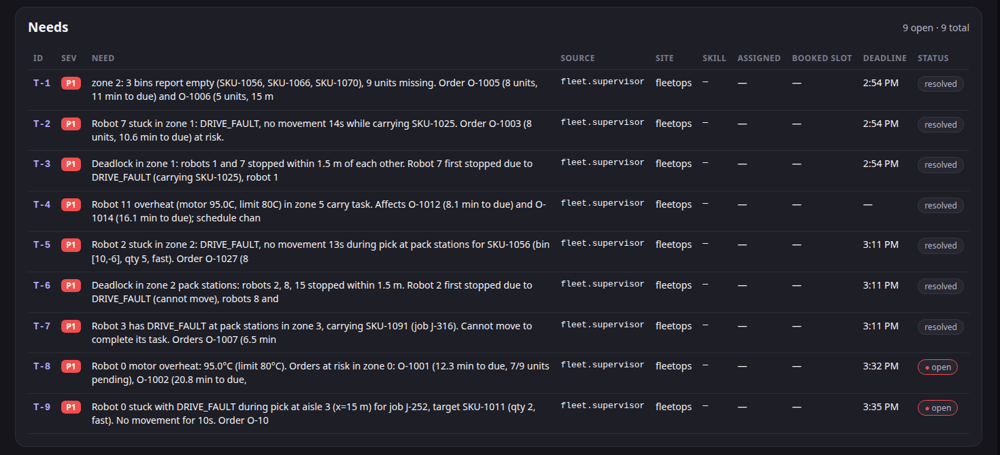
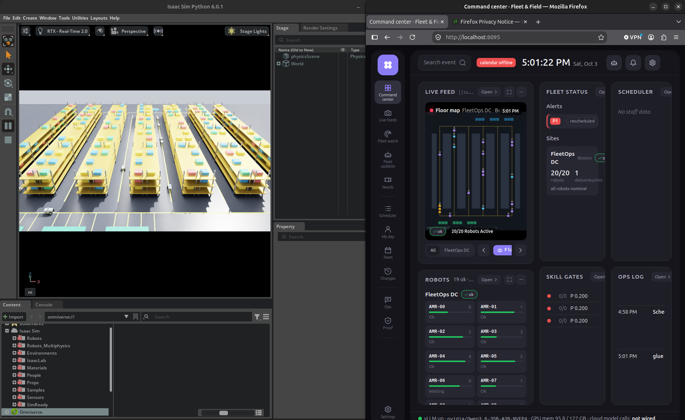
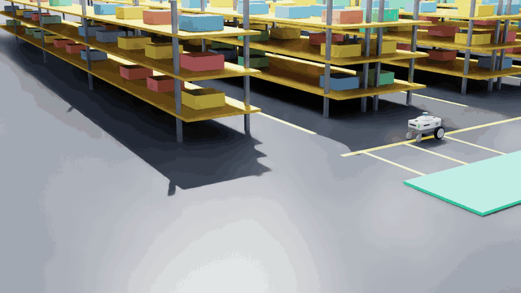

> Copied from the team's repo, [github.com/mochi-bunny/navfix](https://github.com/mochi-bunny/navfix), as it stood
> on 2026-10-03 at 17:58 EDT. Its "App Map" and "Getting Started" describe that repo's layout; this repo's
> layout is in [hyperion-README.md](hyperion-README.md).

# Hyperion

<p align="left">
  
  
  
  
  
  <a href="https://discord.gg/KRZSbK4Qt"></a>
</p>

**Finds the problem. Finds the person. Gets them there. Without a single cloud call.**

Hyperion is an operations supervisor built from two LLMs that run entirely on one Dell Pro Max GB10. A
**supervisor agent** reads live telemetry, decides what actually needs a person, traces each incident
to its root cause and opens a ticket with the evidence. A **scheduler LLM** turns every ticket into a
plain-English card in Discord, where the person on shift approves the fix with one ✅. Both models are
the same Qwen3.6-35B served by vLLM on the box, the agent lives in a NemoClaw sandbox that can reach its
own tools and nothing else, and no prompt, log, location or camera frame is ever sent to a cloud model.
The first deployment is a 20-robot warehouse simulated in Isaac Sim on the same machine.

**Runs on:** one Dell Pro Max GB10, 128 GB unified memory, zero cloud model calls
**Discord:** [discord.gg/KRZSbK4Qt](https://discord.gg/KRZSbK4Qt), where the scheduler posts its cards and takes approvals
**Built for:** Dell Pro Max with GB10 Hackathon, 2026-10-03, Hult International Business School, Cambridge MA

<p align="center">
  <br/>
  <sub>Every ticket here was written by the local supervisor LLM, including a deadlock traced back to the robot that stopped first.</sub>
</p>

---

## Snapshot

- **Two local LLMs, one model server:** `nvidia/Qwen3.6-35B-A3B-NVFP4` on vLLM serves both the
  supervisor agent and the scheduler bot, sharing the GB10's 128 GB of unified memory with the simulator
- **A supervisor that reasons, not just alerts:** an OpenClaw agent with thinking on, 11 tools over the
  live operation, and one ticket per root cause instead of one per symptom
- **Sandboxed by design:** the agent runs inside a NemoClaw (OpenShell) sandbox whose only way out is
  its own tool service; anything else it tries is refused
- **A scheduler LLM for people:** writes the debrief and headline for every card in under a second,
  posts to Discord, and turns ✅ / ❌ reactions back into ticket updates
- **Code enforces, the model explains:** detection, thresholds, ticket states and the trust gate are
  code; the LLMs decide what matters, what to say, and to whom
- **Private by construction:** operations data, footage and where your people are never leave the
  box; the dashboard shows `cloud model calls: not wired` because there is no path to one
- **Measured on the box:** problem detected in 2 to 3 s, root-cause ticket from the agent in 15 to 94 s,
  Discord card about 4 s later, scheduler debriefs in 0.4 to 0.9 s

<p align="center">
  <br/>
  <sub>Everything on one screen and one box: the simulated warehouse, and the command center fed by both local LLMs.</sub>
</p>

<table>
  <tr>
    <td width="50%"></td>
    <td width="50%"></td>
  </tr>
  <tr>
    <td><sub>Command center: tickets, fleet status and live camera video from the sim.</sub></td>
    <td><sub>The first deployment: 20 robots in a simulated warehouse, on the same GB10.</sub></td>
  </tr>
</table>

---

## Built With

<p align="left">
  
  
  
  
  
  
  
  
  
</p>

---

## What It Does

### For the people on shift
- Get told about problems in plain English in [Discord](https://discord.gg/KRZSbK4Qt), not as error
  codes: what broke, why, which orders are at risk, and what to do next
- Approve or reject a fix with one reaction; the ticket updates itself
- Ask the supervisor anything about the operation ("which robots are waiting for traffic, and why?") and
  get an answer built from live data, not a guess
- Watch it all on a live command center: tickets, fleet status, and camera video from the sim

### Behind the scenes: the supervisor LLM
- Woken by a webhook the moment code detects a problem, then pulls what it needs through 11 tools:
  fleet state, a single robot, zone inventory, metrics, events, tickets, trust and commissioning
- Thinks before it acts (reasoning on, Qwen chat-template thinking), so a five-robot jam becomes one
  ticket that names the robot that stopped first, not five tickets
- Writes tickets with evidence, priority and a deadline; a repeat report of the same event updates the
  open ticket instead of duplicating it
- Runs inside a NemoClaw sandbox: it can call its tool service and nothing else

### Behind the scenes: the scheduler LLM
- Lives in navbot, the Discord bot, and calls the same local Qwen model
- Writes the debrief for `#red-room` cards and the headlines for recaps and ETAs, in 0.4 to 0.9 s
- Routes approvals to `#approvals` and sends every ✅ / ❌ back to the supervisor as a ticket update

### Behind the scenes: the guardrails in code
- Nine detectors read telemetry eight times a second (stuck, deadlock, drive fault, overheat, low
  battery, inventory mismatch, low stock, stale telemetry, throughput drop), so the model never has to
  watch a firehose
- Ticket states are an allow-list (`open → acknowledged → rescheduled → resolved`, plus `escalated` and
  `failed`); neither model can skip a step or reopen a closed ticket
- Nothing new goes live on faith: a Thompson-sampling gate only commissions a new robot skill once it is
  95% sure the success rate is at least 80%

---

## App Map

```text
navfix/
  supervisor/                    The supervisor LLM's world
    tools_service.py               Detectors, tickets, trust and commissioning (:8090)
    tools.json                     The 11 tools the agent can call
    openclaw/                      Agent instructions and the supervisor skill for OpenClaw
    bandit.py                      Thompson-sampling trust gate
  navbot/                        Discord bot + scheduler LLM (:8787), see navbot/README.md
  dashboard/                     Command center (:8095), see dashboard/README.md
  fleetops/                      Integration and deployment
    glue/fleetops_glue.py          Supervisor tickets -> navbot and the dashboard (:7100)
    enable_thinking.sh             Turns on the agent's reasoning mode
    docker/                        One image, six services, compose with health checks
    fleetops.sh                    start | stop | status | isaac | headless | reset-demo | build
    tools/                         e2e.sh (timed end-to-end), ask_agent.sh (talk to the supervisor)
    sim/                           The warehouse: fleet logic, sim bridge (:3001), headless runner
    isaac/warehouse_live.py        Isaac Sim scene with live cameras (:8212)
  docs/img/                      Screenshots and the demo GIF used here
```

---

## Project Details

- Model: `nvidia/Qwen3.6-35B-A3B-NVFP4`, a 35B mixture-of-experts with about 3B active per token, in
  NVIDIA's 4-bit NVFP4 format, served by vLLM at half the GPU memory so the simulator fits alongside
- Supervisor agent: OpenClaw in a NemoClaw / OpenShell sandbox, reasoning on, tool search off so it
  always sees its full toolset, webhook-triggered
- Scheduler LLM: navbot calls the same vLLM endpoint over an OpenAI-compatible API on localhost
- Hardware: one Dell Pro Max GB10 (Grace Blackwell, aarch64, 128 GB unified memory) runs the model, both
  agents, the simulator and the dashboard together
- Services: tool service, glue, dashboard, Discord bot, sim bridge and headless sim in one Docker image,
  host networking, health checks, `restart: unless-stopped`
- Secrets: the Discord token and shared keys live in owner-only env files, never in the image or in git
- Team: Ferbin (integration, supervisor LLM setup, simulation, deployment), Thiago (supervisor tool
  service and skill, business model), Megha (navbot, scheduler LLM, command center), Amal (command
  center UI)

---

## Data Model

Two records connect the code and the models. An **event** is what the code saw: a type, the robot or
robots involved, the zone, a severity and a timestamp. A **ticket** is what the supervisor LLM decided:
the `event_id` it came from, `robot_id`, `zone`, a plain-English `reason`, `priority`, `needed_by`, the
`evidence` the model cited, an `assignee` and `eta` from the scheduler side, and a `history` of every
state change with who made it and why. Only the supervisor's tools can write tickets, every state change
is checked against the allow-list, and the glue forwards each new ticket to the scheduler LLM as
`TASK_FAILED` (plus `APPROVAL_REQUEST` when the fix changes the schedule). The trust gate keeps its own
store of trials, so a skill's record survives restarts.

---

## Getting Started

### Prerequisites
- A Dell Pro Max GB10 (or DGX Spark) with Docker and the NVIDIA container runtime
- vLLM serving `nvidia/Qwen3.6-35B-A3B-NVFP4` on port 8000
- A NemoClaw sandbox running the OpenClaw gateway, with the skill from `supervisor/openclaw/`
- A Discord bot token and channel ids in `navbot/.env` (see `navbot/.env.example`)
- Optional: Isaac Sim 6.0 in `~/isaacsim-env` for the 3D warehouse (a headless sim runs without it)

### Install & Run

```bash
git clone https://github.com/mochi-bunny/navfix
cd navfix/fleetops

./fleetops.sh start                # model check, six containers in order, agent check
./fleetops.sh isaac                # optional: the Isaac Sim warehouse becomes the live source
./fleetops.sh status               # command center -> http://localhost:8095
```

Talk to the supervisor, or run a timed incident end to end:

```bash
tools/ask_agent.sh "Which robots are waiting for traffic, and why?"
tools/e2e.sh stuck                 # inject, then time detection -> LLM ticket -> dashboard -> Discord
```

Then watch the cards arrive in the [Discord](https://discord.gg/KRZSbK4Qt). Full deployment notes are in
[`fleetops/README.md`](https://github.com/mochi-bunny/navfix/blob/main/fleetops/README.md).

---

## Roadmap

### Shipped for the hackathon
- [x] Supervisor LLM with reasoning, 11 tools and root-cause tickets, sandboxed in NemoClaw
- [x] Scheduler LLM with Discord cards and working ✅ / ❌ approvals
- [x] Both models served locally from one vLLM instance, zero cloud calls
- [x] Code-enforced ticket states and a statistical trust gate
- [x] Live command center and a 20-robot simulated first deployment
- [x] One-command Docker deployment with health checks

### Next
- [ ] Swap the adapter for other operations: facilities, hospitals, retail and utilities run the same loop
- [ ] Live calendars and travel time so the scheduler books a real person, not just a slot
- [ ] Feed tickets into existing field-service tools instead of replacing them

---

## License

Built for the Dell Pro Max with GB10 Hackathon, 2026. Not for production use as-is.
